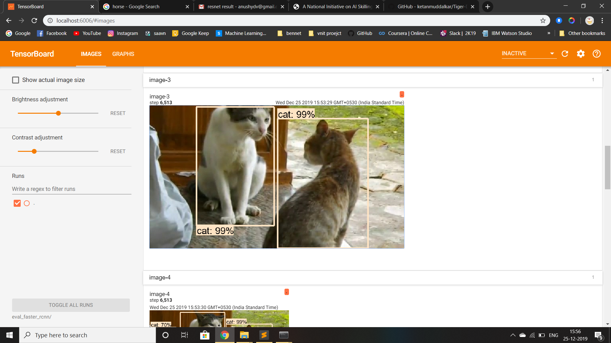

# Stray Animal Detection

## Brief Summary

This repository is a tutorial for how to use TensorFlow's Object Detection API to train an object detection classifier for Stray Animals using Ananconda.

This readme describes every step required to train your own custom classifying stray animals: 
1. Data Preprocessing
2. Setting up the working environment
3. Generate training data and Configuring training
4. Saving and Inferring the model


The repository is inspired by the [How To Train an Object Detection Classifier for Multiple Objects Using TensorFlow (GPU) on Windows 10](https://github.com/EdjeElectronics/TensorFlow-Object-Detection-API-Tutorial-Train-Multiple-Objects-Windows-10) repository.

[Appendix: Common Errors](https://github.com/EdjeElectronics/TensorFlow-Object-Detection-API-Tutorial-Train-Multiple-Objects-Windows-10#appendix-common-errors)

<p align="center">
  
</p>

## Introduction
The purpose of this tutorial is to explain how to train your own convolutional neural network object detection classifier for multiple objects, starting from scratch.

TensorFlow-GPU allows you to use the video card to provide extra processing power while training, so it will be used for this tutorial. In my experience, using TensorFlow-GPU instead of regular TensorFlow reduces training time by a factor of about 8 (3 hours to train instead of 24 hours). Regular TensorFlow can also be used for this tutorial, but it will take longer.


## Steps
### 1. Data Preprocessing

#### 1a. Gather and Label Pictures
Here comes the fun part! With all the pictures gathered, it’s time to label the desired objects in every picture. LabelImg is a great tool for labeling images, and its GitHub page has very clear instructions on how to install and use it.

LabelImg GitHub link(https://github.com/tzutalin/labelImg)


Download and install LabelImg, point it to your \images\train directory, and then draw a box around each object in each image. Repeat the process for all the images in the \images\test directory. This will take a while!

LabelImg saves a .xml file containing the label data for each image. These .xml files will be used to generate TFRecords, which are one of the inputs to the TensorFlow trainer. Once you have labeled and saved each image, there will be one .xml file for each image in the \test and \train directories.


### 2. Setting up the working environment
The TensorFlow Object Detection API requires using the specific directory structure provided in its GitHub repository. It also requires several additional Python packages, specific additions to the PATH and PYTHONPATH variables, and a few extra setup commands to get everything set up to run or train an object detection model. 

This portion of the tutorial goes over the full set up required. It is fairly meticulous, but follow the instructions closely, because improper setup can cause unwieldy errors down the road.


#### 2a. Set up TensorFlow Directory.
Create a folder directly and name it “tensorflow1”. This working directory will contain the full TensorFlow object detection framework, as well as your training images, training data, trained classifier, configuration files, and everything else needed for the object detection classifier.

Download the full TensorFlow object detection repository located at https://github.com/tensorflow/models by clicking the “Clone or Download” button and downloading the zip file. Open the downloaded zip file and extract the “models-master” folder directly into the tensorflow1 directory you just created. Rename “models-master” to just “models”.


#### 2b. Download the Faster-RCNN-Inception-V2-COCO model from TensorFlow's model zoo
TensorFlow provides several object detection models (pre-trained classifiers with specific neural network architectures) in its [model zoo](https://github.com/tensorflow/models/blob/master/research/object_detection/g3doc/detection_model_zoo.md). Some models (such as the SSD-MobileNet model) have an architecture that allows for faster detection but with less accuracy, while some models (such as the Faster-RCNN model) give slower detection but with more accuracy.

You can choose which model to train your objection detection classifier on. If you are planning on using the object detector on a device with low computational power (such as a smart phone or Raspberry Pi), use the SDD-MobileNet model. If you will be running your detector on a decently powered laptop or desktop PC, use one of the RCNN models. 

This tutorial will use the Faster-RCNN-Inception-Resnet50model, we also the same using SSD-Inception-v2 and SSDLite-MobileNet. Download the Faster-RCNN-Inception-V2 model and simultaneously extract .

#### 2c. Download this tutorial's repository from GitHub
Download the full repository located on this page (scroll to the top and click Clone or Download) and extract all the contents directly into the tensorflow1/models/research/object_detection directory. (You can overwrite the existing "README.md" file.) This establishes a specific directory structure that will be used for the rest of the tutorial. Also, move the train/ and val/ created earlier from your local system to the server.

At this point, here is what your /object_detection folder should look like, the following are the important bits:

```
tensorflow1
|
|-- models
|   |-- research
|		|-- object_detection
|			|-- images
|			|	|-- train
|			|	|-- val
|			|-- faster_rcnn_inception_v2_coco_2018_01_28
|						
```

#### 2d. Configure PYTHONPATH environment variable and install the dependencies

```
set PYTHONPATH=C:\Users\anush\tensorflow1\models;C:\Users\anush\tensorflow1\models\research;C:\Users\anush\tensorflow1\models\research\slim

$ pip install tensorflow-gpu==1.12
$ pip install pillow lxml Cython matplotlib pandas opencv-python
```
(Note: The ‘pandas’ and ‘opencv-python’ packages are not needed by TensorFlow, but they are used in the Python scripts to generate TFRecords and to work with images, videos, and webcam feeds.)

#### 2e. Compile Protobufs and run setup.py
Next, compile the Protobuf files, which are used by TensorFlow to configure model and training parameters. Unfortunately, the short protoc compilation command posted on TensorFlow’s Object Detection API [installation page](https://github.com/tensorflow/models/blob/master/research/object_detection/g3doc/installation.md) does not work everytime. Every  .proto file in the /object_detection/protos directory must be called out individually by the command.

 Change directories to the tensorflow1/models/research directory and copy and paste the following command into the command line and press Enter:
```
protoc --python_out=. .\object_detection\protos\anchor_generator.proto .\object_detection\protos\argmax_matcher.proto .\object_detection\protos\bipartite_matcher.proto .\object_detection\protos\box_coder.proto .\object_detection\protos\box_predictor.proto .\object_detection\protos\eval.proto .\object_detection\protos\faster_rcnn.proto .\object_detection\protos\faster_rcnn_box_coder.proto .\object_detection\protos\grid_anchor_generator.proto .\object_detection\protos\hyperparams.proto .\object_detection\protos\image_resizer.proto .\object_detection\protos\input_reader.proto .\object_detection\protos\losses.proto .\object_detection\protos\matcher.proto .\object_detection\protos\mean_stddev_box_coder.proto .\object_detection\protos\model.proto .\object_detection\protos\optimizer.proto .\object_detection\protos\pipeline.proto .\object_detection\protos\post_processing.proto .\object_detection\protos\preprocessor.proto .\object_detection\protos\region_similarity_calculator.proto .\object_detection\protos\square_box_coder.proto .\object_detection\protos\ssd.proto .\object_detection\protos\ssd_anchor_generator.proto .\object_detection\protos\string_int_label_map.proto .\object_detection\protos\train.proto .\object_detection\protos\keypoint_box_coder.proto .\object_detection\protos\multiscale_anchor_generator.proto .\object_detection\protos\graph_rewriter.proto .\object_detection\protos\calibration.proto .\object_detection\protos\flexible_grid_anchor_generator.proto
```
This creates a name_pb2.py file from every name.proto file in the /object_detection/protos folder.

**(Note: TensorFlow occassionally adds new .proto files to the /protos folder. If you get an error saying ImportError: cannot import name 'something_something_pb2' , you may need to update the protoc command to include the new .proto files.)**

Finally, run the following commands from the /tensorflow1/models/research directory:
```
 python setup.py build
 python setup.py install
```

### 3. Generate Training Data

#### 3a. Generate CSV and tfrecords

With the images labeled, it’s time to generate the TFRecords that serve as input data to the TensorFlow training model. This tutorial uses the xml_to_csv.py and generate_tfrecord.py scripts from [Dat Tran’s Raccoon Detector dataset](https://github.com/datitran/raccoon_dataset), with some slight modifications to work with our directory structure.

First, the image .xml data will be used to create .csv files containing all the data for the train and test images. From the /object_detection folder, issue the following command on Anaconda Prompt:
```
 python xml_to_csv.py
```
This creates a train_labels.csv and val_labels.csv file in the /object_detection/images folder. 

Next, open the generate_tfrecord.py file in a nano text editor. Replace the label map starting at line 31 with your own label map, where each object is assigned an ID number. This same number assignment will be used when configuring the labelmap.pbtxt file in Step 5b. 

For example, say you are training a classifier to detect tigers. You will replace the following code in generate_tfrecord.py:
```
def class_text_to_int(row_label):
    if row_label == 'cow':
        return 1
    elif row_label == 'dog':
        return 2
    elif row_label == 'horse':
        return 3
    elif row_label == 'goat':
        return 4
    elif row_label == 'monkey':
        return 5
    elif row_label == 'cat':
        return 6
    
    else:
        print('None')
        return 0
```
Then, generate the TFRecord files by issuing these commands from the /object_detection folder:
```
python generate_tfrecord.py --csv_input=images/train_labels.csv --image_dir=images/train --output_path=images/train.record
python generate_tfrecord.py --csv_input=images/val.csv --image_dir=images/val --output_path=images/val.record
```
These generate a train.record and a test.record file in /object_detection. These will be used to train the new object detection classifier.

#### 3b. Create Label Map 
The last thing to do before training is to create a label map and edit the training configuration file. The label map tells the trainer what each object is by defining a mapping of class names to class ID numbers. Use a text editor to create a new file and save it as labelmap.pbtxt in the /tensorflow1/models/research/object_detection/training_faster_rcnn folder. (Make sure the file type is .pbtxt, not .txt !) In the text editor, copy or type in the label map in the format below:
```
item {
  id: 1
  name: 'cow'
}
item {
  id: 2
  name: 'dog'
}
item {
  id: 3
  name: 'horse '
}
item {
  id: 4
  name: 'goat'
}
item {
  id: 5
  name: 'monkey'
}

item {
  id: 6
  name: 'cat'
}

```

#### 3c. Configure training
Finally, the object detection training pipeline must be configured. It defines which model and what parameters will be used for training. This is the last step before running training!

Navigate to /tensorflow1/models/research/object_detection/samples/configs and copy the ssd_inception_v2_pets.config file into the /object_detection/training_faster_rcnn directory. Then, open the file with a text editor. There are several changes to make to the .config file, mainly changing the number of classes and examples, and adding the file paths to the training data.

Make the following changes to the faster_rcnn_inception_v2_coco.config file. Note: The paths must be entered with single forward slashes (NOT backslashes), or TensorFlow will give a file path error when trying to train the model! Also, the paths must be in double quotation marks ( " ), not single quotation marks ( ' ).

- Line 9. Change num_classes to the number of different objects you want the classifier to detect. For the above Tiger class, it would be num_classes : 1 .
- Line 110. Change fine_tune_checkpoint to:
  - fine_tune_checkpoint : "tensorflow1/models/research/object_detection/ssd_inception_v2_coco_2018_01_28/model.ckpt"

- Lines 126 and 128. In the train_input_reader section, change input_path and label_map_path to:
  - input_path : "tensorflow1/models/research/object_detection/images/train.record"
  - label_map_path: "tensorflow1/models/research/object_detection/training_faster_rcnn/labelmap.pbtxt"

- Line 132. Change num_examples to the number of images you have in the /images/test directory.

- Lines 140 and 142. In the eval_input_reader section, change input_path and label_map_path to:
  - input_path : "tensorflow1/models/research/object_detection/images/val.record"
  - label_map_path: "tensorflow1/models/research/object_detection/training_faster_rcnn/labelmap.pbtxt"

Save the file after the changes have been made. That’s it! The training job is all configured and ready to go!

#### 3c. Run the training

Here we go! From the /object_detection directory, issue the following command to begin training, assuming that after running the nvidia-smi command, GPU '7' is free:
```
python train.py --logtostderr --train_dir=training/ --pipeline_config_path=training/ssd_inception_v2_coco.config
```
If everything has been set up correctly, TensorFlow will initialize the training. The initialization can take up to 30 seconds before the actual training begins. When training begins, it will look like this:

Each step of training reports the loss. It will start high and get lower and lower as training progresses. For my training on the ssd-Inception-V2 model, it started at about 12.0 and quickly dropped below 2. I recommend allowing your model to train until the loss consistently drops below 0.2, which will take about 10k steps, or about 8 hours (depending on how powerful your CPU and GPU are). Note: The loss numbers will be different if a different model is used. MobileNet-SSD starts with a loss of about 20, and should be trained until the loss is consistently under 2.

The training routine periodically saves checkpoints about every five minutes. You can terminate the training by pressing Ctrl+C while in the command prompt window. I typically wait until just after a checkpoint has been saved to terminate the training. You can terminate training and start it later, and it will restart from the last saved checkpoint. The checkpoint at the highest number of steps will be used to generate the frozen inference graph.

### 4. Saving and Inferring the model

#### 4a. Exporting the inference model
Now that training is complete, the last step is to generate the frozen inference graph (.pb file). From the /object_detection folder, issue the following command, where “XXXX” in “model.ckpt-XXXX” should be replaced with the highest-numbered .ckpt file in the training folder:
```
python export_inference_graph.py --input_type image_tensor --pipeline_config_path training/ssd_inception_v2_coco.config --trained_checkpoint_prefix training/model.ckpt-8903 --output_directory ships_inference_graph
```
This creates a frozen_inference_graph.pb file in the /object_detection/training_faster_rcnn/inference_graph directory. The .pb file contains the object detection classifier.

#### 4b. Evaluating the model

```
python eval.py --logtostderr --pipeline_config_path=training/faster_rcnn_resnet50_coco.config --checkpoint_dir=training/ --eval_dir=eval_faster_rcnn/

```

Copy the eval_faster_rcnn/ into your local machine and issue the following command to visualize your model :
```
$ tensorboard --logdir=eval_faster_rcnn/
```
<p align="center">
  
</p>


### 5. [Deploying it on Raspberry Pi](https://github.com/EdjeElectronics/TensorFlow-Object-Detection-on-the-Raspberry-Pi)
    Edje Electronics tutorial is a very good reference for the same.


## Results on different models :

<p align="center">

</p>

